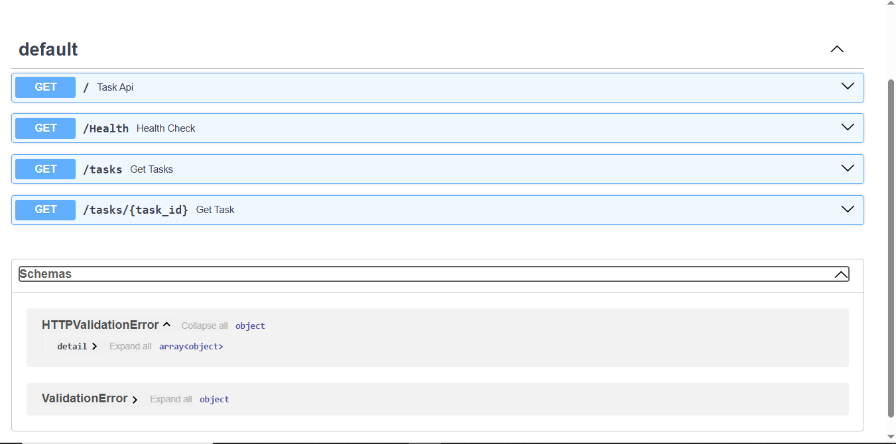

# Task API

A minimal in-memory CRUD API for managing a task list, built with FastAPI. Tasks live in a Python list in memory, so the data resets to the 3 seed tasks whenever the server restarts.

## Install & Run

```bash
pip install fastapi uvicorn && uvicorn CRUD_API:app --reload
```

This installs the two dependencies and starts the server with auto-reload at `http://127.0.0.1:8000`. Interactive Swagger docs are available at `http://127.0.0.1:8000/docs`.

## Endpoints

| Method | Path          | Description                          |
|--------|---------------|----------------------------------------|
| GET    | `/`           | API info (name, version, endpoints)     |
| GET    | `/Health`     | Health check                            |
| GET    | `/tasks`      | List all tasks                          |
| GET    | `/tasks/{id}` | Get a single task by ID                 |
| POST   | `/tasks`      | Create a new task                       |
| PUT    | `/tasks/{id}` | Update an existing task's title/done    |
| DELETE | `/tasks/{id}` | Delete a task                           |

## Example Request

```bash
curl -i http://127.0.0.1:8000/tasks
```

**Output:**

```
HTTP/1.1 200 OK
date: Tue, 14 Jul 2026 12:24:13 GMT
server: uvicorn
content-length: 147
content-type: application/json

[{"id":1,"title":"Buy groceries","done":false},{"id":2,"title":"Finish FastAPI tutorial","done":true},{"id":3,"title":"Walk the dog","done":false}]
```

## Swagger UI



